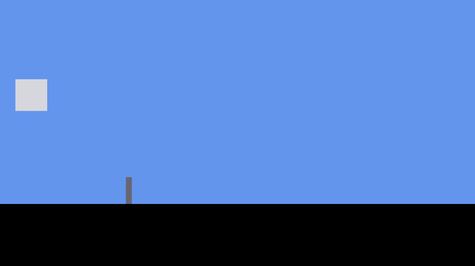
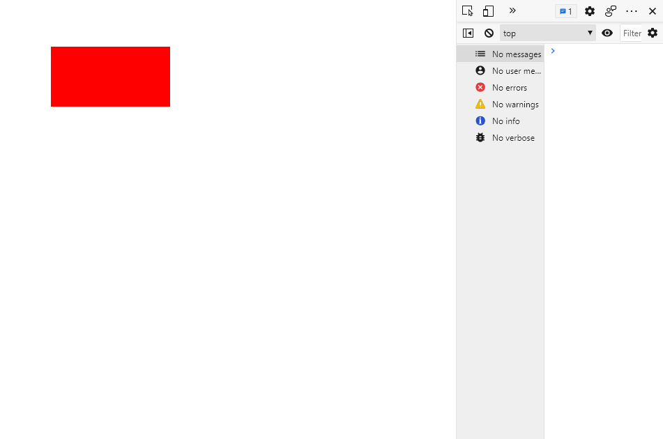
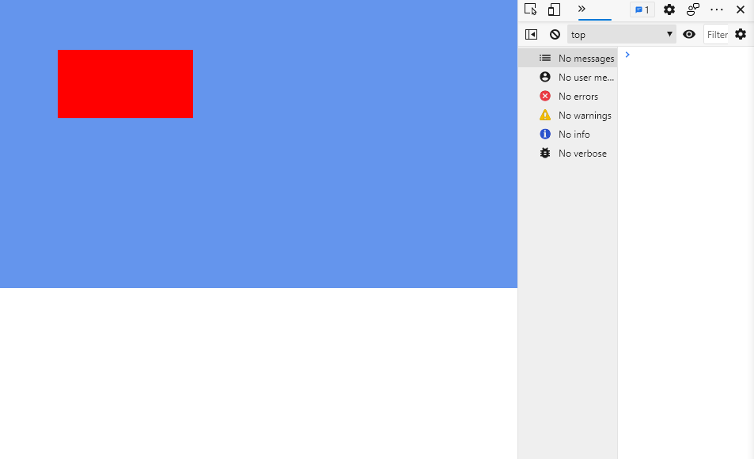
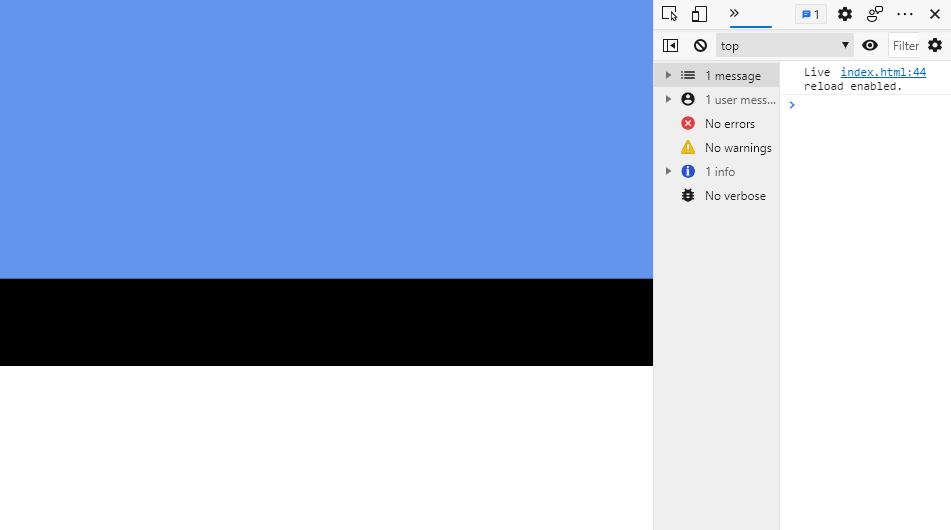
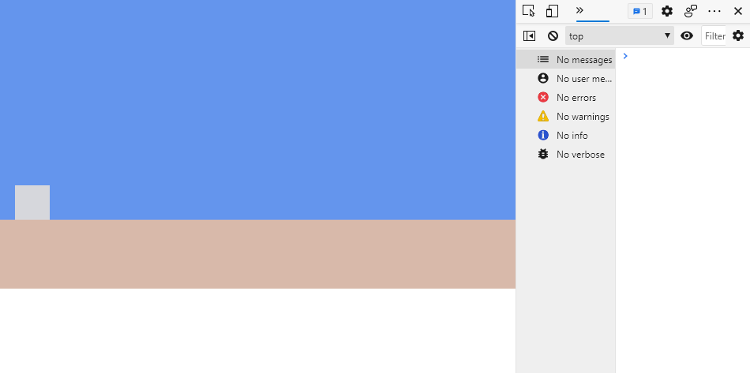

# Canvas Runner

Tutorial for simple endless runner using the HTML [Canvas](https://www.w3schools.com/html/html5_canvas.asp) API and vanilla JavaScript.



## Goal

---

Last as long as you can.

## Controls

---

W, Arrow Up, or Space to Jump.

W, Arrow Up, or Space to reset game after Game Over.

## Tutorial

Recommended Tools: VSCode

### Parts

- [I. Start Code](#i.-start-code)
- [II. Drawing on the Canvas](#ii.-drawing-on-the-canvas)
- [III. Writing Game Loops](#iii.-writing-game-loops)
- [IV. Introducing the Player & Classes](#iv.-introducing-the-player-&-classes)
- [V. Jumping & Gravity](#v.-jumping-&-gravity)
- [VI. Spikes - the Spice of Life](#vi.-spikes---the-spice-of-life)

### I. Start Code

---

Create an `index.html` file and add some boilerplate HTML as well as a `<canvas>` elements to the body.
If using VSCode, you can use the `html:5` macro to generate this easier. Simply type `html:5`, press Enter and it will autocomplete for you.

`index.html`
``` html
<!DOCTYPE html>
<html lang="en">
<head>
    <meta charset="UTF-8">
    <meta http-equiv="X-UA-Compatible" content="IE=edge">
    <meta name="viewport" content="width=device-width, initial-scale=1.0">
    <title>Canvas Runner</title>
</head>
<body>
    <canvas></canvas>
</body>
</html>
```

Create a `styles` folder to contain all of your stylesheets and create a `styles.css` file for your page. Add the following style rules.

`styles.css`
``` css
body { 
    margin: 0;
    overflow: hidden;
}

canvas {
    width: 100%;
    max-height: 100vh;
}
```

These styles will make sure that the canvas covers the entire width of the window and that the page does not create a scrollbar if the height of the canvas gets too big for it (creating a full-screen canvas). 

Attach the styles to the `index.html` page in the `<head>` section with: 

```html
<link rel="stylesheet" href="./styles/styles.css">
```


Create a `src` (meaning source) folder to contain all of your scripts and create a `main.js` file.

Inside of `main.js` add a "use strict" directive to the top. Literally write the string "use strict" followed by a semicolon (;). This indicates to the JavaScript to not allow and warn about "bad code" (like using undeclared variables) which would normally be allowed outside of strict mode. This can save you from a lot of headaches when debugging and will make your code cleaner.

Also, add an `init` function and call it as soon as the window loads. This is to make sure that all DOM Elements (`<h1>`'s, `<p>`'s, `<canvas>`) are actually created on the page before the init function is called. 

`main.js`
``` javascript
"use strict";

const init = () => {

};

window.onload = () => {
    // Preload anything - fonts, images, sounds, etc...

    init();
};
```

Import the `main.js` script back in `index.html` with a `<script>` tag in the `<head>` section.

`index.html`
``` html
<!DOCTYPE html>
<html lang="en">
<head>
    <meta charset="UTF-8">
    <meta http-equiv="X-UA-Compatible" content="IE=edge">
    <meta name="viewport" content="width=device-width, initial-scale=1.0">
    <link rel="stylesheet" href="./styles/styles.css">
    <script src="./src/main.js"></script>
    <title>Canvas Runner</title>
</head>
<body>
    <canvas></canvas>
</body>
</html>
```

And with that, our starting code is out of the way. 

To see your page you have several options, here's two:
1. Look at your page in the browser by opening up `index.html` and any time you save changes and want to see them, close the tab and open up `index.html` again.
2. Or, ideally, if you are using VSCode or any other code editor, find a simple local server functionality with automatic reloads whenever you make a change so that you don't have to reopen your file (In VSCode look for the Live Server extension, then right-click `index.html` and click `Open with Live Server`). 

### II. Drawing on the Canvas

---

Next we will retrieve the canvas and save it into a variable in our script using JavaScript's document.querySelector(String) function. Then, we will set its width and height to an arbitrary resolution.

These two dimensions will determine how many pixels are in the canvas so we can work with absolute pixel measurements and not have to worry about the actual size of the canvas on the window (which the CSS handles).

Be mindful that whatever numbers you choose for the resolution will influence the rest of your code. It will affect your x, y positions and your game physics like gravity and velocity.

`main.js`
``` javascript
"use strict";

// Constants
const CANVAS_WIDTH = 3840;
const CANVAS_HEIGHT = 2160;

const init = () => {
    // Get canvas from DOM
    const canvas = document.querySelector("canvas");

    // Set resolution
    canvas.width = CANVAS_WIDTH;
    canvas.height = CANVAS_HEIGHT;
};

window.onload = () => {
    // Preload anything - fonts, images, sounds, etc...

    init();
};
```

Then we will get the canvas' 2D Context. The canvas is the actual element on the page. The context is the interface that will allow us to do all of the drawing. Read all about it [here](https://developer.mozilla.org/en-US/docs/Web/API/CanvasRenderingContext2D).

`main.js`
``` javascript
const init = () => {
    // Get canvas from DOM
    const canvas = document.querySelector("canvas");

    // Set resolution
    canvas.width = CANVAS_WIDTH;
    canvas.height = CANVAS_HEIGHT;

    // Get canvas context
    const ctx = canvas.getContext('2d');
};
```

So now we have our drawing context (ctx). Why don't we do some actual drawing with it? Write this line of code right after you grab the context in init.

`main.js`
``` javascript
// Get canvas context
const ctx = canvas.getContext('2d');

ctx.fillStyle = 'red';
ctx.fillRect(437, 400, 1005, 504);
```

We should now have our first visual feedback that everything is working correctly. Do you see the red rectangle on the screen? Now is a good time to say that if you don't see it, you should press the F12 key on the keyboard and navigate to the console tab (or however else you reach the console in your browser) to address errors (if there are any).



`ctx.fillStyle` is a property and will take any CSS color value as a string and set that as the current color the context is drawing with. Think of it like changing what color pencil you are drawing with.

`ctx.fillRect(x,y,w,h)` will take in 4 parameters and draw a rectangle at that x, y position with 'w' pixel width and 'h' pixel height. From the top left point to the bottom right point.

Note that x, y coordinates in the canvas start from the TOP LEFT corner and x increases going RIGHT and y increases going DOWN.

This is very important! In HTML Canvas, point (0, 0) starts at the TOP LEFT corner and increases going RIGHT and DOWN. That means point (40, 50) is above point (56, 156).

The canvas 2D context has a lot different drawing methods that you can read about [here](https://developer.mozilla.org/en-US/docs/Web/API/CanvasRenderingContext2D#reference) if you want to learn more.

<br>

Okay! Now that we know how to draw with the context. Lets make some helper functions for ourselves. Create a `utils.js` file inside the `src` folder. Don't forget to import it back in `index.html` with a `<script src="./src/utils.js"></script>` tag and make sure to put it before your `main.js` tag as main will make use of our utility functions, so they need to be created first.

Add these two functions inside of `utils.js`:

`utils.js`
``` javascript
"use strict";

// Draws a filled rectangle in canvas
const fillRect = (ctx, x, y, w, h, color = 'black') => {
    ctx.save();
    ctx.fillStyle = color;
    ctx.fillRect(x, y, w, h);
    ctx.restore();
};

// Fills a canvas with a certain color
const fill = (ctx, color) => {
    ctx.save();
    ctx.fillStyle = color;
    ctx.fillRect(0, 0, ctx.canvas.width, ctx.canvas.height);
    ctx.restore();
};
```

First we have our handy `"use strict"` directive which will help us commit less mistakes. Then we have two functions

Our own `fillRect` function which will take a context, all of the parameters needed for a rectangle (x, y, width, height), and a color which is set to a default of `'black'`.

A `fill` function which takes in a context and a color and will set all of the pixels in the canvas a certain color. Notice that the context has a useful back-reference to the canvas element inside of it.

Also of note are the new `ctx.save()` and `ctx.restore()` functions. Basically, `save` will remember the state of the context at the point it is called (like what color is the fillStyle set to) and `restore` will bring the context back to the last save point (or the beginning defaults if there are none).

Whenever you edit states of the context in a function, like the `fillStyle`, you should use `ctx.save()` and `ctx.restore()` to make sure that the function does not affect the context outside of its scope.

<br>

Now we can use our `fill(ctx, color)` and `fillRect(ctx, x, y, w , h, color)` functions back in `main.js` and see our red rectangle against a blue background.



`main.js`
``` javascript
"use strict";

// Constants
const CANVAS_WIDTH = 3840;
const CANVAS_HEIGHT = 2160;
const COLORS = {
    BACKGROUND: 'cornflowerblue',
};

const init = () => {
    // Get canvas from DOM
    const canvas = document.querySelector("canvas");

    // Set resolution
    canvas.width = CANVAS_WIDTH;
    canvas.height = CANVAS_HEIGHT;

    // Get canvas context
    const ctx = canvas.getContext('2d');

    fill(ctx, COLORS.BACKGROUND);
    fillRect(ctx, 437, 400, 1005, 504, 'red');
};

window.onload = () => {
    // Preload anything - fonts, images, sounds, etc...

    init();
};
```

### III. Writing Game Loops

---

Behind any real-time game's code, there is an update loop. Games are real-time applications that have to track state across many frames every second. One common way to do that is to call an update function every single frame. Let's do that.

To be extra organized we will actually have two loops running in our game. An `update()` function that handles the logic and state variables of the game and a `draw(ctx)` function that will take care of rendering the visuals to the canvas. Define them and call them from `init()`.

`main.js`
``` javascript
const update = () => {

};

const draw = (ctx) => {

};

const init = () => {
    // Get canvas from DOM
    const canvas = document.querySelector("canvas");

    // Set resolution
    canvas.width = CANVAS_WIDTH;
    canvas.height = CANVAS_HEIGHT;

    // Get canvas context
    const ctx = canvas.getContext('2d');

    // Start loops
    update();
    draw(ctx);
};
```

Now the problem is that `init()` is only called once and we want these two new functions to be called an indeterminate amount of times while the game is running.

Introducing JavaScript's `setTimeout(function, milliseconds)` and `requestAnimationFrame(function)` functions.

`setTimeout` is a function that will queue up another function to be called after a set amount of time has passed (in milliseconds). We will use this function at the beginning of `update()` so that we can get a constant frame loop for our logic.

`requestAnimationFrame` will also queue up a function to be called later, but you do not have as much control over when this happens. And it may fluctuate! Which is bad for news for when we want to start moving things on the screen. The function will be called on the browser's refresh rate before the next repaint, so it is perfect for rendering.

`main.js`
``` javascript
// Constants
const CANVAS_WIDTH = 3840;
const CANVAS_HEIGHT = 2160;
const COLORS = {
    BACKGROUND: 'cornflowerblue',
};
const FPS = 60;

const update = () => {
    setTimeout(update, 1 / FPS);

    // Update Code
};

const draw = (ctx) => {
    requestAnimationFrame(() => draw(ctx));

    // Drawing Code
};
```

So there we have it. `update()` and `draw(ctx)` are functions that set timers to call themselves at a later point and will do this endlessly (for as long as the browser tab is open). This does not cause a stack overflow error because by the time that the next `update()` is called, the previous one is done. Likewise for `draw(ctx)`.

Notice that in `draw(ctx)`, we actually pass an anonymous (nameless) one-line function `() => /* your code here */` that itself calls `draw(ctx)`. Because `draw(ctx)` has a parameter (the context), we can't just pass the function directly like we do with `setTimeout(update, 1 / FPS);` as we would not be able to pass this parameter to future `draw(ctx)` calls.

<br>

In draw, lets fill the screen with a background color every frame. This serves two purposes.
1. It provides a nice colorful and interesting background and clarifies the area of our canvas.
2. It draws over (thus clearing) anything rendered in the previous frame.

And while we are at it, let's also draw the floor for our runner game.



`main.js`
``` javascript
// Constants
const CANVAS_WIDTH = 3840;
const CANVAS_HEIGHT = 2160;
const COLORS = {
    BACKGROUND: 'cornflowerblue',
    FLOOR: '#d8b9aa',
};
const FPS = 60;
const FLOOR_HEIGHT = 512;

const update = () => {
    setTimeout(update, 1 / FPS);

    // Update Code
};

const draw = (ctx) => {
    requestAnimationFrame(() => draw(ctx));

    // Draw background
    fill(ctx, COLORS.BACKGROUND);

    // Draw floor
    fillRect(ctx, 0, CANVAS_HEIGHT - FLOOR_HEIGHT, CANVAS_WIDTH, FLOOR_HEIGHT, COLORS.FLOOR);
};
```

Notice that the y position of the floor is `CANVAS_HEIGHT - FLOOR_HEIGHT`. Subtracting the height of the floor from the lowest point in the canvas brings the y position up to the point we want. We are subtracting because smaller y values will bring you up! Canvas goes from TOP to BOTTOM!

<br>

Even though we don't see it, this same screen is getting drawn on top of itself every animation frame. Because nothing changes it looks like a static screen. If you want proof that this is happening over and over, write a `console.log('reached!');` statement in either `update()` or `draw(ctx)` and go to the console. Look at all of those console logs!

(This might lag your browser because console logs are a very resource expensive function in fast loops like these. If it is lagging just close the tab and open `index.html` again).

### IV. Introducing the Player & Classes

---

Now we are going to create our third and last JavaScript file. Create a `classes.js` file in `src`. Don't forget to import it to your page in `index.html`. Make sure it is after `utils.js` as our `classes.js` script will make use of it. Make sure it is before `main.js` as it will be used by it.

This also marks the last change we will have to do to `index.html` so here it is one last time.

`index.html`
``` html
<!DOCTYPE html>
<html lang="en">

<head>
    <meta charset="UTF-8">
    <meta http-equiv="X-UA-Compatible" content="IE=edge">
    <meta name="viewport" content="width=device-width, initial-scale=1.0">
    <link rel="stylesheet" href="./styles/styles.css">
    <script src="./src/utils.js"></script>
    <script src="./src/classes.js"></script>
    <script src="./src/main.js"></script>
    <title>Canvas Runner</title>
</head>

<body>
    <canvas></canvas>
</body>

</html>
```

In our `classes.js` file we will first `"use strict";` and then we will create our first class.

If you don't know what a class is you can find out more about JavaScript classes [here](https://developer.mozilla.org/en-US/docs/Web/JavaScript/Reference/Classes). Essentially, it is a template for creating objects. It defines what an object is by the data it holds (variables), and what it can do (functions).

Here is our starter code for `classes.js`:

`classes.js`
``` javascript
"use strict";

class Rectangle {
    constructor(x, y, w, h) {
        Object.assign(this, { x, y, w, h });
    }
    draw(ctx, color = 'black') {
        fillRect(ctx, this.x, this.y, this.w, this.h, color);
    }
}
```

The first function is our `constructor` which will be called when we use the statement `new Rectangle(x, y, w, h)`and will return an object with those properties.

Object.assign(object, object) will assign all of the properties of the object on the right to the object on the left. This will put all of the parameters passed into our constructor during the call into `this` (the `Rectangle` object being made).

`draw(ctx, color)` is a function that now all `Rectangle` objects will have and can be called from them. It is a helper function that will automatically draw a rectangle with the stored position and size properties.

<br>

Back in `main.js` [forward declare](https://en.wikipedia.org/wiki/Forward_declaration#:~:text=In%20computer%20programming%2C%20a%20forward,yet%20given%20a%20complete%20definition.) the player as a global variable. Set the player equal to a `new Rectangle(x, y, w, h)` and call `player.draw(ctx, color)` in your draw function.



`main.js`
``` javascript
// Constants
const CANVAS_WIDTH = 3840;
const CANVAS_HEIGHT = 2160;
const COLORS = {
    BACKGROUND: 'cornflowerblue',
    FLOOR: '#d8b9aa',
    PLAYER: '#d6d7dc',
};
const FPS = 60;
const FLOOR_HEIGHT = 512;
const PLAYER_START_X = 128;
const PLAYER_SIZE = 256;

// Globals
let player;

const update = () => {
    setTimeout(update, 1 / FPS);

    // Update Code
};

const draw = (ctx) => {
    requestAnimationFrame(() => draw(ctx));

    // Draw background
    fill(ctx, COLORS.BACKGROUND);

    // Draw floor
    fillRect(ctx, 0, CANVAS_HEIGHT - FLOOR_HEIGHT, CANVAS_WIDTH, FLOOR_HEIGHT, COLORS.FLOOR);

    // Draw player
    player.draw(ctx, COLORS.PLAYER);
};

const init = () => {
    // Get canvas from DOM
    const canvas = document.querySelector("canvas");

    // Set resolution
    canvas.width = CANVAS_WIDTH;
    canvas.height = CANVAS_HEIGHT;

    // Get canvas context
    const ctx = canvas.getContext('2d');

    // Init game objects
    player = new Rectangle(PLAYER_START_X, CANVAS_HEIGHT - FLOOR_HEIGHT - PLAYER_SIZE, PLAYER_SIZE, PLAYER_SIZE);

    // Start loops
    update();
    draw(ctx);
};
```

Now that you know how classes and objects work, you should try turning the floor into an object on your own. The same way you did for the player and call its `.draw(ctx, color)` function in the `draw(ctx)` loop.

### V. Jumping & Gravity

---

Time to add some physics to our game!

Go back to the `classes.js` file. We are going to create a new `Entity` class that is going to **extend** our previous `Rectangle` class.

Basically, when a class `extends` another, it contains all of the properties and functionality that the previous class had. And then you can add more on top.

Here is out Entity class:

`classes.js`
``` javascript
"use strict";

class Rectangle {
    constructor(x, y, w, h) {
        Object.assign(this, { x, y, w, h });
    }
    draw(ctx, color = 'black') {
        fillRect(ctx, this.x, this.y, this.w, this.h, color);
    }
}

class Entity extends Rectangle {
    constructor(x, y, w, h) {
        super(x, y, w, h);

        this.acceleration = {
            x: 0,
            y: 0,
        };
        this.velocity = {
            x: 0,
            y: 0,
        };
    }

    update() {
        this.velocity.x += this.acceleration.x;
        this.velocity.y += this.acceleration.y;
        this.x += this.velocity.x;
        this.y += this.velocity.y;
    }
}
```

To run through the new concepts.

The `super` keyword inside our `constructor` will simply call the extended class' constructor (it will set the `x, y, w, h` variables).

We create two new properties inside of our `Entity` object, `acceleration` and `velocity`. These two properties are objects in and of themselves with their own `x, y` properties inside of them. They are Vectors, which you can learn about [here](https://natureofcode.com/book/chapter-1-vectors/) in a chapter of Daniel Shiffman's brief free online book [The Nature of Code](https://natureofcode.com/). An incredibly useful read for anyone interested in getting into game development.

To put it simply, think of these Vectors as arrows pointing in a direction that will apply a force in said direction and their `x, y` properties are what determine that direction and how big that force is.

As we can see in the `update()` function of our `Entity`, the acceleration will affect our velocity and the velocity will affect our `Entity`'s `x, y` position. That cascading effect of forces will be our simple physics system.

<br>

To put this into practice, back in `main.js` change our player from a simple `Rectangle` to an `Entity` (no need to change the parameters as the constructors for both classes are identical).

And finally, for our first piece of code in `update()` call the player's `.update()` method.

Nothing is happening. A little underwhelming. But that's because every single force is set to 0. Let's add a downward force to the player right after they are created. This will be our gravity.

`main.js`
``` javascript
// Constants
const CANVAS_WIDTH = 3840;
const CANVAS_HEIGHT = 2160;
const COLORS = {
    BACKGROUND: 'cornflowerblue',
    FLOOR: '#d8b9aa',
    PLAYER: '#d6d7dc',
};
const FPS = 60;
const FLOOR_HEIGHT = 512;
const PLAYER_START_X = 128;
const PLAYER_SIZE = 256;
const GRAVITY = 1.2;

const update = () => {
    setTimeout(update, 1 / FPS);

    // Update player
    player.update();
};

const init = () => {
    // Get canvas from DOM
    const canvas = document.querySelector("canvas");

    // Set resolution
    canvas.width = CANVAS_WIDTH;
    canvas.height = CANVAS_HEIGHT;

    // Get canvas context
    const ctx = canvas.getContext('2d');

    // Init game objects
    floor = new Rectangle(0, CANVAS_HEIGHT - FLOOR_HEIGHT, CANVAS_WIDTH, FLOOR_HEIGHT);
    player = new Entity(PLAYER_START_X, CANVAS_HEIGHT - FLOOR_HEIGHT - PLAYER_SIZE, PLAYER_SIZE, PLAYER_SIZE);
    player.acceleration.y = GRAVITY;

    // Start loops
    update();
    draw(ctx);
};
```

Finally, our first signs of movement in the game. The player fell through the floor and left the screen. Nothing is stopping our player from doing so as the floor is simply a `Rectangle` drawn on screen. It has no physical properties. So lets stop the player from doing so back in `update()` right after the `player.update()` method.

``` javascript
const update = () => {
    setTimeout(update, 1 / FPS);

    // Update player
    player.update();
    // Don't let player go below the floor
    if (player.y > CANVAS_HEIGHT - FLOOR_HEIGHT - player.h) {
        player.y = CANVAS_HEIGHT - FLOOR_HEIGHT - player.h;
    }
};
```

And just like that, nothing is moving again. That's because our player starts on the ground. If you want to watch our player fall and hit the ground you can change it's starting y position in `init()`. Remember that you will have to subtract in order to get the player to a higher point.

So gravity works. Let's get our player jumping.

For that, we will have to pay attention to keyboard inputs from the user. We will achieve this using JavaScript's Event system, which you can read about [here](https://developer.mozilla.org/en-US/docs/Learn/JavaScript/Building_blocks/Events).

Essentially Events are things that can happen and we can preemptively pass functions to be executed whenever those Events happen.

Here is our Event handling code back in `init()`:

`main.js`
``` javascript
// Constants
const CANVAS_WIDTH = 3840;
const CANVAS_HEIGHT = 2160;
const COLORS = {
    BACKGROUND: 'cornflowerblue',
    FLOOR: '#d8b9aa',
    PLAYER: '#d6d7dc',
};
const FPS = 60;
const FLOOR_HEIGHT = 512;
const PLAYER_START_X = 128;
const PLAYER_SIZE = 256;
const GRAVITY = 1.2;
const PLAYER_JUMP_VELOCITY = 48;

const init = () => {
    // Get canvas from DOM
    const canvas = document.querySelector("canvas");

    // Set resolution
    canvas.width = CANVAS_WIDTH;
    canvas.height = CANVAS_HEIGHT;

    // Get canvas context
    const ctx = canvas.getContext('2d');

    // Init game objects
    floor = new Rectangle(0, CANVAS_HEIGHT - FLOOR_HEIGHT, CANVAS_WIDTH, FLOOR_HEIGHT);
    player = new Entity(PLAYER_START_X, CANVAS_HEIGHT - FLOOR_HEIGHT - PLAYER_SIZE, PLAYER_SIZE, PLAYER_SIZE);
    player.acceleration.y = GRAVITY;

    // Events
    document.addEventListener('keydown', e => {
        if ((e.code === 'ArrowUp' || e.code === 'KeyW' || e.code === 'Space')) {
            player.velocity.y = -PLAYER_JUMP_VELOCITY;
        }
    });

    // Start loops
    update();
    draw(ctx);
};
```

We listen for an Event called `'keydown'`. This happens whenever the player presses a key on their keyboard. The `e` parameter of our function is an object containing data about our event. The property we care about is the `code` of the key that was pressed. This helps us determine which key specifically was pressed and if it is one of the ones we want. In this case `'ArrowUp'`, `'KeyW'`, or `'Space'`.

Then, if one of the jump keys was pressed, we skip acceleration on our cascade of forces and set the velocity directly to a negative value. This will make the object travel up for a while until gravity (which is accelerating the object down) eventually takes over and makes it fall back down.

There is one bug we have yet to fix however. Try pressing any of the jump keys multiple times before even reaching the floor. Our player keeps jumping up in the air!

<br>

Let's go back to our `classes.js` file and add one last class (we will come back to this file one more time after this however to make one small edit).

`classes.js`
``` javascript
class Entity extends Rectangle {
    constructor(x, y, w, h) {
        super(x, y, w, h);

        this.acceleration = {
            x: 0,
            y: 0,
        };
        this.velocity = {
            x: 0,
            y: 0,
        };
    }

    update() {
        this.velocity.x += this.acceleration.x;
        this.velocity.y += this.acceleration.y;
        this.x += this.velocity.x;
        this.y += this.velocity.y;
    }
}

class Player extends Entity {
    constructor(x, y, w, h) {
        super(x, y, w, h);

        this.isGrounded = false;
    }
}
```

A class dedicated solely to the player and it `extends Entity` which itself `extends Rectangle`, so it will contain the properties and functionalities of both.

The only change is that now there is a `isGrounded` property which is a Boolean (`true`/`false`) value that we set to `false` when the player is created.

Return to `main.js`. Back in `init()`. change the player to a `new Player(x, y, w, h)` instead of an `Entity` (cnce again, no need to change the parameters). In `update()`, find the piece of code where we check that the player does not go below the floor and set the player's `isGrounded` property to `true`.

`main.js`
``` javascript
const update = () => {
    setTimeout(update, 1 / FPS);

    // Update player
    player.update();
    // Don't let player go below the floor
    if (player.y > CANVAS_HEIGHT - FLOOR_HEIGHT - player.h) {
        player.y = CANVAS_HEIGHT - FLOOR_HEIGHT - player.h;
        player.isGrounded = true;
    }
};
```

Now we know the player will be grounded whenever they hit the floor.

In our `'keydown'` Event function, check that the player is grounded before trying to jump and set their `isGrounded` property back to `false` when we do jump.

`main.js`
``` javascript
// Events
    document.addEventListener('keydown', e => {
        if (player.isGrounded && (e.code === 'ArrowUp' || e.code === 'KeyW' || e.code === 'Space')) {
            player.velocity.y = -PLAYER_JUMP_VELOCITY;
            player.isGrounded = false;
        }
    });
```

The jump should be working as intended now.

We are almost done! All we need now is a losing condition, an obstacle for the player to jump over.

### VI. Spikes - the Spice of Life

---

Thankfully, because of our structure, we already have most of the pieces we need to make the spikes.

We will be working a lot with random integers in the following lines of code so let us visit an old friend, our `utils.js` file and add a helper function to get a random integer (no decimal point) number between two numbers.

`utils.js`
``` javascript
// Fills a canvas with a certain color
const fill = (ctx, color) => {
    ctx.save();
    ctx.fillStyle = color;
    ctx.fillRect(0, 0, ctx.canvas.width, ctx.canvas.height);
    ctx.restore();
};

// Returns random integer number between min (inclusive) and max (inclusive)
const randomRangeInt = (min, max) => {
    min = Math.ceil(min);
    max = Math.floor(max);
    return Math.floor(Math.random() * (max - min + 1)) + min;
};
```

Let's forward declare our array of spikes among the globals and create a helper `spawnSpike()` function that will be our last infinite loop.

`main.js`
``` javascript
// Constants
const CANVAS_WIDTH = 3840;
const CANVAS_HEIGHT = 2160;
const COLORS = {
    BACKGROUND: 'cornflowerblue',
    FLOOR: '#d8b9aa',
    PLAYER: '#d6d7dc',
};
const FPS = 60;
const FLOOR_HEIGHT = 512;
const PLAYER_START_X = 128;
const PLAYER_SIZE = 256;
const GRAVITY = 1.2;
const PLAYER_JUMP_VELOCITY = 48;
const SPIKES_VELOCITY = 10;

// Globals
let floor;
let player;
let spikes = [];

// Spawns a moving spike off-screen every few seconds
const spawnSpike = () => {
    setTimeout(spawnSpike, randomRangeInt(2000, 5000))

    // Create spike
    const width = randomRangeInt(32, 64);
    const height = randomRangeInt(128, 256);
    const spike = new Entity(CANVAS_WIDTH, CANVAS_HEIGHT - FLOOR_HEIGHT - height, width, height);

    // Init spike velocity
    spike.velocity.x = -SPIKES_VELOCITY;

    // Add to spikes list
    spikes.push(spike);
};

const update = () => {
    ...
```

Like `update()`, `spawnSpike()` is a function that calls itself on a timeout. Except the timeout this time is much longer 2000-5000 milliseconds, so 2-5 seconds.

We set some randomization for the spikes' width and height so that they all look different and have different difficulties.

We set an initial negative x velocity that stays constant, making the spikes move towards the player at a constant speed.

And we add the newly created spike to the array of spikes so we can handle them all together later.

<br>

Back in `init()` start the spikes' spawning loop after `update()` and `draw(ctx)`.

`main.js`
``` javascript
const init = () => {

    ...

    // Events
    document.addEventListener('keydown', e => {
        if (player.isGrounded && (e.code === 'ArrowUp' || e.code === 'KeyW' || e.code === 'Space')) {
            player.velocity.y = -PLAYER_JUMP_VELOCITY;
            player.isGrounded = false;
        }
    });

    // Start loops
    update();
    draw(ctx);
    spawnSpike();
};
```

In `update()`, use JavaScript's `Array.forEach(function(element))` method to apply a function to all the individual spikes in the `spikes` array. In this case, a function that calls each spike's `.update()` method.

Then, remove any spikes that move off-screen from the array so that we don't have to update or draw them anymore and we can forget about them. You can use JavaScript's `Array.filter(function(element))` method. This method returns a copy of your array with all elements that pass the return condition of the function you pass into it.

In this case, I am passing a function that tells it to give me a copy of the array with all of the spikes who are still on-screen (`spike.x > -spike.w`).

I use `spike.x > -spike.w` because I want the spikes whose x position is above `0 - spike.w`, 0 being the leftmost point in the canvas. Meaning there is at least some part of it left on-screen.

`main.js`
``` javascript
const update = () => {
    setTimeout(update, 1 / FPS);

    // Update player
    player.update();
    // Don't let player go below the floor
    if (player.y > CANVAS_HEIGHT - FLOOR_HEIGHT - player.h) {
        player.y = CANVAS_HEIGHT - FLOOR_HEIGHT - player.h;
        player.isGrounded = true;
    }

    // Spikes
    spikes.forEach(spike => {
        // Update spikes
        spike.update();
    });
    // Remove offscreen spikes
    spikes = spikes.filter(spike => spike.x > -spike.w);
};
```

In `draw(ctx)`, use `Array.foreach()` once again to call the `.draw(ctx, color)` method of every individual spike in the array. Make sure to draw the spikes before the player so that the player is rendered on top of them

`main.js`
``` javascript
// Constants
const CANVAS_WIDTH = 3840;
const CANVAS_HEIGHT = 2160;
const COLORS = {
    BACKGROUND: 'cornflowerblue',
    FLOOR: '#d8b9aa',
    PLAYER: '#d6d7dc',
    SPIKES: '#686573',
};
const FPS = 60;
const FLOOR_HEIGHT = 512;
const PLAYER_START_X = 128;
const PLAYER_SIZE = 256;
const GRAVITY = 1.2;
const PLAYER_JUMP_VELOCITY = 48;
const SPIKES_VELOCITY = 10;

const draw = (ctx) => {
    requestAnimationFrame(() => draw(ctx));

    // Draw background
    fill(ctx, COLORS.BACKGROUND);

    // Draw floor
    floor.draw(ctx, COLORS.FLOOR);

    // Draw spikes
    spikes.forEach(spike => spike.draw(ctx, COLORS.SPIKES));

    // Draw player
    player.draw(ctx, COLORS.PLAYER);
};
```

Now we have some spikes moving into the screen every now and then. Great!

But they are moving past the player and off the screen when the player doesn't jump over them. We need to know when the player is touching a spike. And to do that, we need to go back to `classes.js` one last time like I said before.

Go back to your very first class, the `Rectangle` class and add this last `areColliding(rect1, rect2)` method to it:

`classes.js`
``` javascript
class Rectangle {
    constructor(x, y, w, h) {
        Object.assign(this, { x, y, w, h });
    }
    draw(ctx, color = 'black') {
        fillRect(ctx, this.x, this.y, this.w, this.h, color);
    }
    static areColliding(rect1, rect2) {
        // AABB Collision Test
        return rect1.x < rect2.x + rect2.w &&
            rect1.x + rect1.w > rect2.x &&
            rect1.y < rect2.y + rect2.h &&
            rect1.y + rect1.h > rect2.y;
    }
}
```

This is a simple 2D Collision Detection Algorithm called AABB, which you can read more about [here](https://developer.mozilla.org/en-US/docs/Games/Techniques/2D_collision_detection#axis-aligned_bounding_box). It tells us if two rectangles are overlapping by taking in two `Rectangle` objects and returning `true` or `false`.

The `static` keyword means that this function is not called from any given `Rectangle` object. It is called from the class definition itself with the syntax `Rectangle.areColliding(rect1, rect2)`.

So let's put it to use.

Back in `main.js`, in the `update()` loop, find the `spikes.forEach()` and after updating a spike, check if a collision happened with the player.

`main.js`
``` javascript
const update = () => {
    ...

    // Spikes
    spikes.forEach(spike => {
        // Update spikes
        spike.update();

        // Check collision
        if (Rectangle.areColliding(player, spike)) {
            // Game over
            // Do game over logic here
        }
    });
    // Remove offscreen spikes
    spikes = spikes.filter(spike => spike.x > -spike.w);
};
```

So what are we going to do when the player hits a spike?

Let's define three new functions in `main.js` after `update()` and before `draw(ctx)`:
1. `reset()`
2. `tryReset(e)`
3. `stop()`

`main.js`
``` javascript
// Resets game parameters back to the start
const reset = () => {
    // Reset player
    player.y = CANVAS_HEIGHT - FLOOR_HEIGHT - PLAYER_SIZE;
    player.velocity.y = 0;

    // Clear spikes
    spikes = [];

    // Start the updates again
    update();
    spawnSpike();
};

// Tries to reset game
const tryReset = (e) => {
    if (e.code === 'ArrowUp' || e.code === 'KeyW' || e.code === 'Space') {
        // Remove event listener for self
        document.removeEventListener('keydown', tryReset);
        // Reset game
        reset();
    }
};

// Stops game updates and waits for a reset
const stop = () => {
    clearTimeout(updateID);
    clearTimeout(spawnSpikeID);

    // Add event listener for reset
    document.addEventListener('keydown', tryReset);
};
```

Together, these three functions define the flow of the Game Over state. 

When a collision happens between a spike and the player, `stop()` will be called. This will stop the currently queued (and thus subsequent) update and spawnSpike calls. `stop()` will also start listening for `'keydown'` events and call `tryReset(e)` whenever they are triggered.

`tryReset(e)` will check if one of the jump keys was pressed. If so, it will remove itself from the listener and call `reset()`.

`reset()` does exactly what you would expect. Resets the player's position and velocity, clears the spikes array, and starts the `update()` loop again.

<br>

Something I didn't mention before is that both the `setTimeout(function, milliseconds)` and `requestAnimationFrame(function)` functions return a `Number` value, which is the id of the timeout request that we can use to cancel it. We weren't saving it before because it was not being used, but it will prove very useful for the stop feature.

Create globals for the spawnSpikeID and updateID and in their respective functions, cache the return value of their `setTimeout(function, milliseconds)` call. In `update()`, if a collision is found with the player, call `stop()`.

The `spawnSpike()` and `update()` loops would end up looking like so:

`main.js`
``` javascript
// Globals
let floor;
let player;
let spikes = [];
let spawnSpikeID;
let updateID;

// Spawns a moving spike off-screen every few seconds
const spawnSpike = () => {
    spawnSpikeID = setTimeout(spawnSpike, randomRangeInt(2000, 5000))

    // Create spike
    const width = randomRangeInt(32, 64);
    const height = randomRangeInt(128, 256);
    const spike = new Entity(CANVAS_WIDTH, CANVAS_HEIGHT - FLOOR_HEIGHT - height, width, height);

    // Init spike velocity
    spike.velocity.x = -SPIKES_VELOCITY;

    // Add to spikes list
    spikes.push(spike);
};

const update = () => {
    updateID = setTimeout(update, 1 / FPS);

    // Update player
    player.update();
    // Don't let player go below the floor
    if (player.y > CANVAS_HEIGHT - FLOOR_HEIGHT - player.h) {
        player.y = CANVAS_HEIGHT - FLOOR_HEIGHT - player.h;
        player.isGrounded = true;
    }

    // Spikes
    spikes.forEach(spike => {
        // Update spikes
        spike.update();

        // Check collision
        if (Rectangle.areColliding(player, spike)) {
            // Game over
            stop();
        }
    });
    // Remove offscreen spikes
    spikes = spikes.filter(spike => spike.x > -spike.w);
};
```

Finally, we are nearing the end of this tutorial and there is only one last thing to take care of. Because of the scope our functions and variables were declared on, the player currently has full control over the game logic through the console. They can call update(), they can call stop(), and even mess with the spikes array and that is very bad news for our game.

The quickest way to solve this is to declare all of the code in our `main.js` file within an [IIFE](https://flaviocopes.com/javascript-iife/#:~:text=An%20Immediately%2Dinvoked%20Function%20Expression%20(IIFE%20for%20friends)%20is,way%20to%20isolate%20variables%20declarations.). Put simply, it is an anonymous function that is called as soon as it is created and it serves to create an enclosed scope that no outside script can access.

You can create and immediately call an IIFE in JavasCript by enclosing your code in the following syntax

``` javascript
(() => {
    /* Your code here */
})();
```

In the end, our `main.js` file would look like so:

`main.js`
``` javascript
(() => {
    "use strict";

    // Constants
    const CANVAS_WIDTH = 3840;
    const CANVAS_HEIGHT = 2160;
    const COLORS = {
        BACKGROUND: 'cornflowerblue',
        FLOOR: '#d8b9aa',
        PLAYER: '#d6d7dc',
        SPIKES: '#686573',
    };
    const FPS = 60;
    const FLOOR_HEIGHT = 512;
    const PLAYER_START_X = 128;
    const PLAYER_SIZE = 256;
    const GRAVITY = 1.2;
    const PLAYER_JUMP_VELOCITY = 48;
    const SPIKES_VELOCITY = 10;
    
    // Globals
    let floor;
    let player;
    let spikes = [];
    let spawnSpikeID;
    let updateID;
    
    // Spawns a moving spike off-screen every few seconds
    const spawnSpike = () => {
        spawnSpikeID = setTimeout(spawnSpike, randomRangeInt(2000, 5000))
    
        // Create spike
        const width = randomRangeInt(32, 64);
        const height = randomRangeInt(128, 256);
        const spike = new Entity(CANVAS_WIDTH, CANVAS_HEIGHT - FLOOR_HEIGHT - height, width, height);
    
        // Init spike velocity
        spike.velocity.x = -SPIKES_VELOCITY;
    
        // Add to spikes list
        spikes.push(spike);
    };
    
    const update = () => {
        updateID = setTimeout(update, 1 / FPS);
    
        // Update player
        player.update();
        // Don't let player go below the floor
        if (player.y > CANVAS_HEIGHT - FLOOR_HEIGHT - player.h) {
            player.y = CANVAS_HEIGHT - FLOOR_HEIGHT - player.h;
            player.isGrounded = true;
        }
    
        // Spikes
        spikes.forEach(spike => {
            // Update spikes
            spike.update();
    
            // Check collision
            if (Rectangle.areColliding(player, spike)) {
                // Game over
                stop();
            }
        });
        // Remove offscreen spikes
        spikes = spikes.filter(spike => spike.x > -spike.w);
    };
    
    // Resets game parameters back to the start
    const reset = () => {
        // Reset player
        player.y = CANVAS_HEIGHT - FLOOR_HEIGHT - PLAYER_SIZE;
        player.velocity.y = 0;
    
        // Clear spikes
        spikes = [];
    
        // Start the updates again
        update();
        spawnSpike();
    };
    
    // Tries to reset game
    const tryReset = (e) => {
        if (e.code === 'ArrowUp' || e.code === 'KeyW' || e.code === 'Space') {
            // Remove event listener for self
            document.removeEventListener('keydown', tryReset);
            // Reset game
            reset();
        }
    };
    
    // Stops game updates and waits for a reset
    const stop = () => {
        clearTimeout(updateID);
        clearTimeout(spawnSpikeID);
    
        // Add event listener for reset
        document.addEventListener('keydown', tryReset);
    };
    
    const draw = (ctx) => {
        requestAnimationFrame(() => draw(ctx));
    
        // Draw background
        fill(ctx, COLORS.BACKGROUND);
    
        // Draw floor
        floor.draw(ctx, COLORS.FLOOR);
    
        // Draw spikes
        spikes.forEach(spike => spike.draw(ctx, COLORS.SPIKES));
    
        // Draw player
        player.draw(ctx, COLORS.PLAYER);
    };
    
    const init = () => {
        // Get canvas from DOM
        const canvas = document.querySelector("canvas");
    
        // Set resolution
        canvas.width = CANVAS_WIDTH;
        canvas.height = CANVAS_HEIGHT;
    
        // Get canvas context
        const ctx = canvas.getContext('2d');
    
        // Init game objects
        floor = new Rectangle(0, CANVAS_HEIGHT - FLOOR_HEIGHT, CANVAS_WIDTH, FLOOR_HEIGHT);
        player = new Player(PLAYER_START_X, CANVAS_HEIGHT - FLOOR_HEIGHT - PLAYER_SIZE, PLAYER_SIZE, PLAYER_SIZE);
        player.acceleration.y = GRAVITY;
    
        // Events
        document.addEventListener('keydown', e => {
            if (player.isGrounded && (e.code === 'ArrowUp' || e.code === 'KeyW' || e.code === 'Space')) {
                player.velocity.y = -PLAYER_JUMP_VELOCITY;
                player.isGrounded = false;
            }
        });
    
        // Start loops
        update();
        draw(ctx);
        spawnSpike();
    };
    
    window.onload = () => {
        // Preload anything - fonts, images, sounds, etc...
    
        init();
    };
})();
```